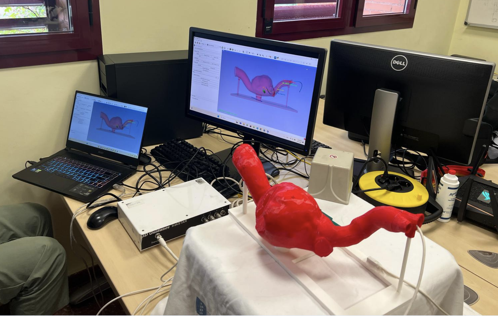

# Endovascular Aneurysm Repair Using Electromagnetic Tracking

## Overview
This project presents a phantom-based simulation for endovascular aneurysm procedures using electromagnetic tracking. Developed by students from the Master's in Machine Learning for Health from Universidad Carlos III de Madrid, it aims to enhance surgical accuracy and safety while minimizing radiation exposure to patients during endovascular aneurysm repair procedures.

## Authors
- Celia de la Fuente Montero
- Sandra Eizaguerri Gallardo
- Ana González Aranda
- Duarte Moura
- Paula Ochotorena Santacilia

## Features
- Real-time electromagnetic tracking of surgical instruments
- 3D visualization of aneurysm and vascular structures
- Optimal path guidance for catheter navigation
- Distance monitoring to target areas
- Trajectory recording and analysis
- Deviation monitoring from optimal path
- Registration capabilities for accurate tracking

## Requirements
- 3D Slicer
- PLUS Toolkit
- Electromagnetic tracking system
- 3D-printed phantom model of aneurysm and aortic/iliac arteries

## Setup Instructions

### 1. Installation
1. Install 3D Slicer
2. Install PLUS Toolkit
3. Clone this repository
4. Load the AneurysmModule into 3D Slicer

### 2. Hardware Setup
1. Connect the electromagnetic tracking system
2. Set up the 3D-printed phantom model
3. Ensure proper calibration of tracking sensors

## Usage

### Basic Operation
1. Load the module in 3D Slicer
2. Click "Load Data" to initialize the system
3. Connect to PLUS using the "Connect to Plus" button
4. Build the transform tree for navigation

### Key Features

#### Registration
- Use "Add Point" to mark registration points
- "Remove Point" to delete incorrect points
- "Compute Registration" to perform the registration
- "Reset Registration" to start over

#### Navigation
- Monitor distance to target using the distance display
- Toggle aneurysm opacity for better visualization
- Show/hide optimal path for guidance
- Record tracking path for analysis

#### Monitoring
- Real-time distance monitoring to target areas
- Deviation monitoring from optimal path
- Visual feedback for navigation accuracy

## File Structure
- `AneurysmModule/`: Main module directory
  - `AneurysmModule.py`: Core module implementation
  - `Resources/`: Contains necessary data files
    - `Data/`: 3D models and tracking data
    - Note: You need to have access to the data and modules available in the drive folder (put there for storage size reasons). Unzip the folder and add the content to 'Data/' folder 

## Acknowledgments
Department of Bioengineering, Universidad Carlos III de Madrid

